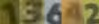
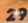
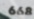
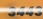
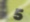

# 🏷️ Price Tag OCR: Распознавание ценников (Custom ClovaAI)

[](https://www.python.org/downloads/)
[](https://pytorch.org/)
[](https://colab.research.google.com/)

Проект посвящен задаче оптического распознавания цифр (OCR) на магазинных ценниках (алфавит: `0123456789`). Для достижения высокой точности используется ансамбль из двух нейросетей, обученных на оригинальных, аугментированных (склеенных) и полностью синтетических данных.

Основой для моделей послужил мой собственный форк фреймворка [ClovaAI (deep-text-recognition-benchmark)](https://github.com/ziiiegen/deep-text-recognition-benchmark), который импортируется непосредственно в ноутбуках и содержит ряд важных архитектурных улучшений.

## 🌟 Особенности кастомного ClovaAI и Архитектура

Для проекта используется следующая конфигурация слоев:
**`TPS (4 fiducials)` ➡️ `ResNet` ➡️ `BiLSTM (hidden_size 256)` ➡️ `CTC`**

В оригинальный репозиторий ClovaAI были внесены следующие изменения:
- 🐛 **Исправлены баги** и проблемы несовместимости версий библиотек.
- 🚀 **Добавлен оптимизатор AdamW** (`--adamW`) для лучшей регуляризации весов.
- 📉 **Внедрен Cosine Annealing Scheduler** для плавного изменения learning rate.
- 🎨 **Интегрирован блок аугментаций**, настроенный под специфику ценников.
- 📏 **Параметры входа:** Изображения приводятся к размеру `96x110` с использованием паддинга (`--PAD`), максимальная длина предсказания — 6 символов.

## 📂 Структура проекта

```text
├── data/
│   ├── data.txt                # Ссылки на скачивание датасетов 
│   ├── price_13642_20749b32.jpg# Пример склейки кропов
│   └── ideal_synthetics_*.jpg  # Примеры сгенерированной синтетики
├── src/
│   ├── src_crop_number.py      # Скрипт для вырезания кропов отдельных цифр с ценников
│   └── scr_new_dataset.py      # Скрипт для склейки кропов в новые данные
├── ClovaAI_CTC_first.ipynb     # Обучение первой модели ансамбля
├── ClovaAI_CTC_syntetic.ipynb  # Предобучение второй модели на синтетических данных
├── ClovaAI_CTC_fine_tuning.ipynb # Дообучение (Fine-tuning) второй модели
├── Ansamble.ipynb              # Ансамбль двух моделей для финального предсказания
└── Create_syntetic.ipynb       # Пайплайн генерации синтетических данных
```

## 📊 Данные: Генерация и Склейка

Ссылки на итоговые датасеты (увеличенный оригинальный с кропами и синтетический) находятся в файле `\data\data.txt`.

### 1. Склейка кропов
Для обогащения выборки скрипты `src_crop_number.py` и `scr_new_dataset.py` вырезают отдельные цифры из реальных ценников и комбинируют их в новые изображения.

**Пример склейки кропов цифр:**
<br>


### 2. Синтетические данные
В `Create_syntetic.ipynb` реализован пайплайн для создания синтетических ценников с нуля для этапа Pre-training.

**Примеры сгенерированной синтетики:**
<p float="left">
  
   
  
  
</p>

## 🧠 Обучение и результаты (Ансамбль)

Пайплайн состоит из двух различных подходов к обучению, результаты которых затем объединяются:

1. **Модель 1 (`ClovaAI_CTC_first.ipynb`)**: Обучается напрямую на смешанном датасете (оригинал + склеенные кропы).
2. **Модель 2 (`ClovaAI_CTC_syntetic.ipynb` -> `ClovaAI_CTC_fine_tuning.ipynb`)**: Сначала проходит стадию Pre-training на синтетике, затем — Fine-tuning на реальных данных.

### 🤝 Логика ансамблирования (`Ansamble.ipynb`)
Алгоритм объединения предсказаний:
1. Если предсказания Модели 1 и Модели 2 полностью **совпадают** — берем этот ответ.
2. Если предсказания **различаются** — извлекаются показатели уверенности (Confidence scores) обеих моделей, взвешиваются, и итоговым ответом становится предсказание с наибольшим весом уверенности.

### 🏆 Метрики качества

| Подход | Best Val Accuracy | Test Score |
| :--- | :---: | :---: |
| **Модель 1** (Смешанные данные) | 99.118 | 0.9770 |
| **Модель 2** (Синтетика + Fine-Tuning) | 99.063 | 0.9800 |
| 🚀 **Финальный Ансамбль** | - | **0.9827** |

## 🛠 Как запустить

Все Jupyter ноутбуки адаптированы для работы в **Google Colab**. 
Зависимости и установка модифицированного репозитория ClovaAI производятся автоматически прямо в ячейках ноутбуков (через `!pip install` и `!git clone https://github.com/ziiiegen/deep-text-recognition-benchmark`).

1. Скачайте данные по ссылкам из `data/data.txt` и загрузите их в рабочую среду.
2. Для воспроизведения результатов запускайте ноутбуки в следующем порядке:
   - Обучение 1: `ClovaAI_CTC_first.ipynb`
   - Обучение 2: `ClovaAI_CTC_syntetic.ipynb` -> `ClovaAI_CTC_fine_tuning.ipynb`
3. Используйте `Ansamble.ipynb` для финального инференса.